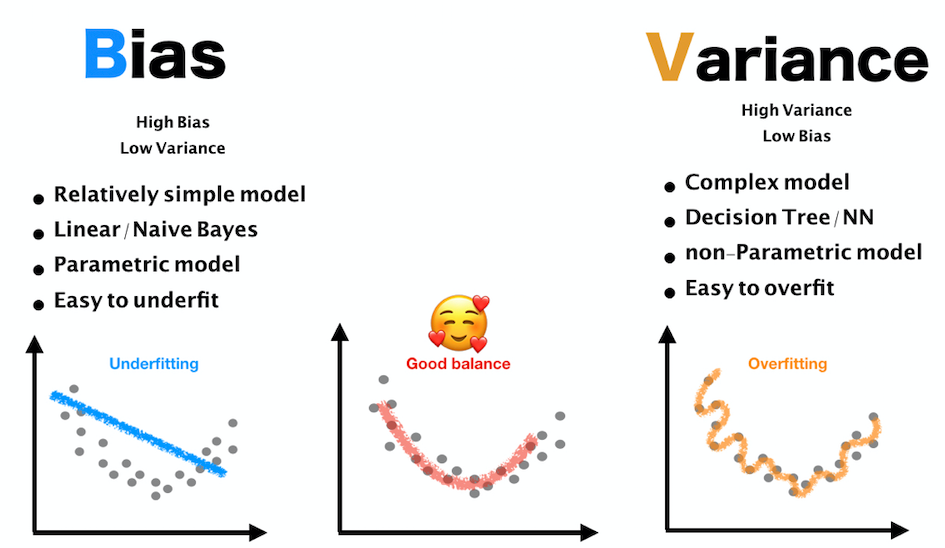

### What is Bias-Variance tradeoff?

- a central problem in supervised learning
- when we choose a predictive model, we want to satisfy
    > 1. `Accurately captures the regularities in its training data`
    > 2. `Generalizes well to unseen data`  
    Unfortunately, it is typically impossible to do both simultaneously
 

- `Variance`  
= error from sensitivity to small fluctuations in the training set.  
High variance -> include random noise in the training data  
Overfitting
 

- `Bias`  
= error from erroneous assumptions in the learning algorithm.  
High bias -> cause an algorithm to miss the relevant relations between features and target outputs  
Underfitting

- `Irreducible Error`  
= Intrinsic uncertainty/randomness  
= exists in even the best possible model 

### What is Regularization?

- Regularization in Machine Learning means reducing overfitting **by punishing model complexity**

- Lambda allows us to adjust model complexity

### Ridge vs LASSO Linear Regression? 

- LASSO
= cost function of LASSO Regression: L1 norm 
= 

- Ridge
= cost function of Ridge Regression: L2 norm 
= 

- L1 vs L2 norm
= L1 regularization can occasionally produce non-unique solutions. 
= A simple example is provided in the figure when the space of possible solutions lies on a 45 degree line. This can be problematic for certain applications 
= 
= can be overcome by combining {\displaystyle L_{1}} L_{1} with {\displaystyle L_{2}} L_{2} regularization in elastic net regularization

- Elastic Net

= 

